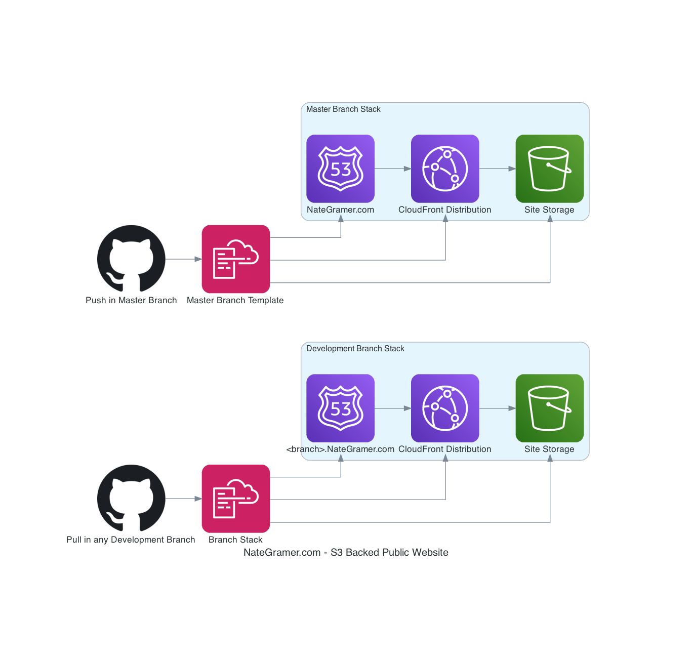

# Nate Gramer's Personal Website

 

This is my Gatsby.js website based on Resume by startbootstrap.

I wanted to create a website with a build process that I could CI/CD out to cloud providers (AWS in particular). While I'm certainly not a Web Developer, I didn't like the idea of a flat, boring, Bootstrap site on its own. 

My goals for architecture are:
- Serverless capability
- Static Foundation
-  (Eventual) Dynamic Content

React and Gatsby seem to fit this bill with strong plugin support, so I'm rolling with it.

## Site Architecture

## Cloning / Forking this repo

Check out the great instructions by [Anubhav](https://github.com/anubhavsrivastava/gatsby-starter-resume)

### Contribution

Spelling and Grammar corrections are welcome!