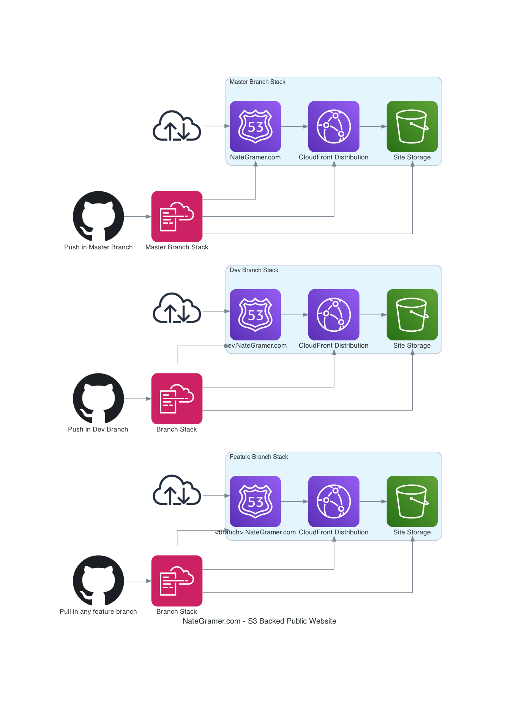

# Nate Gramer's Personal Website

  

This is my personal website built with [Hugo framework](https://gohugo.io/) using the [PaperMod](https://github.com/adityatelange/hugo-PaperMod) theme.

I wanted to create a website with a build process that I could CI/CD out to cloud providers (AWS in particular). While I'm certainly not a Web Developer, I didn't like the idea of a flat, boring, Bootstrap site on its own.

My goals for architecture are:

- Serverless capability
- Static Foundation
- (Eventual) Dynamic Content

## Site Architecture

### Contribution

Spelling and Grammar corrections are welcome!
